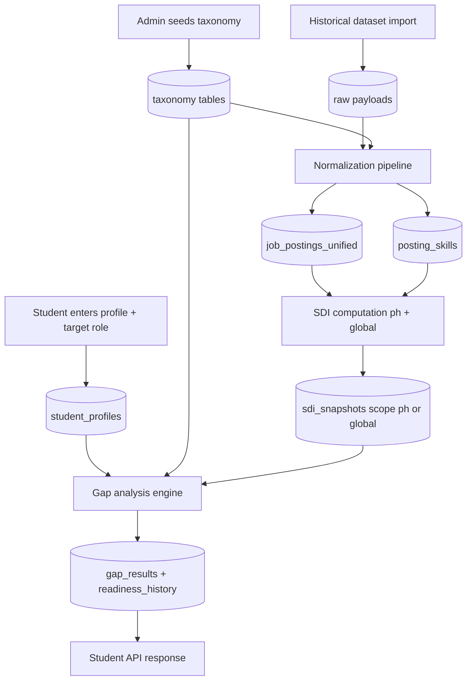
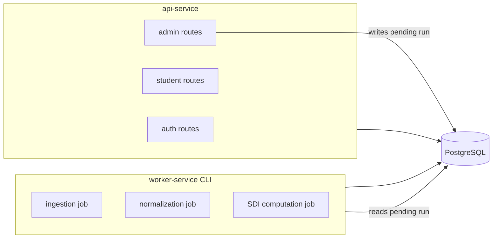

# ARCH-PLAN-MVP-2026-03-28-v2

> Revision of ARCH-PLAN-MVP-2026-03-28. Addresses all six conditions from REVIEW-SIGNOFF-MVP-2026-03-28.
> Changes from v1 are marked **[REVISED]** or **[ADDED]**.

---

## What MVP Must Prove

A student can:

1. Register and log in
2. Enter their academic profile (courses, grades, certifications)
3. Declare a target career role
4. Receive a ranked skill gap analysis with a readiness score
5. See a prioritized list of what to work on next

This is the minimum loop that makes the system demonstrable, testable by real students, and validatable by advisers and evaluators. Every module outside this loop is deferred.

---

## Stage 1: MVP — The Core Student Loop

### Modules included

- **`auth`** — registration, login, role-based tokens (`student`, `admin`). Nothing works without identity.
- **`student_profile`** — academic profile, courses with grades, certifications, projects, declared target role. This is the input to all analytics.
- **`taxonomy_admin`** — canonical skills, alias map, course-to-skill mappings, grade-to-depth rules. Analytics cannot run without a seeded taxonomy. Admin-only API endpoints (no UI needed yet).
- **`ingestion`** — historical dataset import only (no live scraping). Load the initial unified PH job postings dataset once. Raw payload persistence included for reprocessability.
- **`normalization`** — canonical schema mapping, deterministic `posting_id` generation, seniority/role standardization, skill extraction (spaCy PhraseMatcher), skill normalization (alias lookup), and `posting_skills` association output. Must run before any analytics.
- **`analytics_sdi`** — SDI snapshot computation for **`ph` and `global`** in one worker run (`run_sdi_refresh` twice: all countries, then `country=PH`). **Student-facing gap analysis** calls `get_weighted_sdi(..., scope="ph")` first; if a role has no PH snapshots yet, it **falls back to `global`** so rankings still work on mixed or non-PH datasets. See `backend/docs/plans/PIPELINE-analytics_sdi.md`.
- **`gap_and_roadmap`** — gap identification (missing + depth gaps), SDI-priority ranking, readiness score computation and history. Roadmap output in MVP is a ranked skill list with priority band; full certification/project recommendations are Stage 2.

### What is intentionally excluded from Stage 1

- Career Intent Parsing via SBERT — replaced by exact-match role selection from catalog (dropdown/search)
- `analytics_decay` — requires multi-period SDI time series; deferred to Stage 2
- `career_affinity` — K-Means clustering; deferred to Stage 3
- `notifications` — deferred to Stage 2
- `reporting_observability` — admin health dashboard; deferred to Stage 2
- Live scraping connectors (LinkedIn PH, JobStreet, Kalibrr) — deferred to Stage 2
- Admin panel UI — admin uses API endpoints directly in Stage 1
- Celery, RQ, message brokers — explicitly excluded from Stage 1

---

### **[REVISED]** Worker Execution Model (Condition 2)

In Stage 1 the worker is **not a service** — it is a separate Python CLI entry point.

- `worker.py` (or `python -m backend.worker`) is invoked manually from the command line by the administrator
- The admin endpoint `POST /admin/jobs/run` writes a `pending` row to the `pipeline_runs` table and returns immediately
- The administrator then runs `worker.py` manually; the worker reads the `pending` run from `pipeline_runs` and executes the pipeline chain
- Alternatively, the admin endpoint can invoke the worker synchronously in-process (acceptable for MVP where data volume is bounded)
- The worker executes the pipeline in a fixed sequential order: ingest raw data → normalize → extract skills → upsert `posting_skills` → compute SDI snapshots → mark run complete
- No background threads, no task queues, no message brokers in Stage 1
- A scheduler (APScheduler or Celery Beat) is added in Stage 2 to automate this chain

---

### **[REVISED]** ETL Data Flow (Condition 5)



The `posting_skills` join table is a required output of normalization. It links each canonical posting to its extracted skill IDs and is the input the SDI pipeline counts against. Without it, SDI computation has no skill frequency data.

**Gap analysis design constraint:** Gap analysis runs **synchronously** when the student calls `GET /student/gap-analysis`. It reads precomputed `sdi_snapshots` (via `get_weighted_sdi`, PH-first with global fallback) and performs set-difference logic in memory against the student's skill inventory. Heavy work stays in the worker; do not move gap computation to a background job for the MVP student loop.

---

### API surface (Stage 1 only)

- `POST /auth/register`
- `POST /auth/login`
- `POST /student/profile`
- `PUT /student/profile`
- `POST /student/target-role`
- `GET /student/gap-analysis`
- `GET /student/readiness-history`
- `GET /admin/roles` — role catalog listing
- `POST /admin/skills`, `POST /admin/aliases`, `POST /admin/course-skill-mappings` — taxonomy seeding
- `POST /admin/jobs/run` — write a pending pipeline run to `pipeline_runs`

---

### **[REVISED]** Data storage strategy (Condition 1)

Transactional tables:

- `users`, `student_profiles`, `course_records`, `certifications`, `projects`
- `skills`, `skill_aliases`, `role_catalog`, `course_skill_map`, `grade_depth_rules`
- `job_postings_unified`, **`posting_skills`** (posting_id, skill_id)
- **`sdi_snapshots`** (skill_id, role_id, period YYYY-MM, sdi_value, **scope: `ph` / `global`**)
- `gap_results`, `readiness_history` (student_id, **period YYYY-MM**, readiness_score, computed_at)
- `pipeline_runs` (run_id, status, started_at, finished_at)

Raw storage:

- Raw job payload files stored on local filesystem under a configurable path (e.g. `data/raw/`). Object store is a Stage 2+ concern.

**Schema design notes:**

- `sdi_snapshots` uses a single table with a `scope` column (`ph` / `global`). Stage 1 already writes both scopes each pipeline run; Stage 2 **decay** reads the same table (typically **`global`** time series). No separate `sdi_snapshots_ph` / `sdi_snapshots_global` tables.
- `readiness_history` includes a `period` column (`YYYY-MM`) from the start to support semester-by-semester querying without retrofitting.

---

### **[ADDED]** Stage 1 acceptance criteria (Condition 6 + Condition 3)

These criteria must be confirmed before the engineer closes the MVP implementation. They apply across all Stage 1 modules:

- `posting_id` generation in normalization is deterministic: re-running normalization on the same raw input produces identical `posting_id` values (idempotency test required)
- Re-running the full pipeline produces no duplicate rows in `job_postings_unified` or `posting_skills`
- `sdi_snapshots` rows are upserted (not appended) on pipeline rerun; counts are stable across reruns
- Gap analysis result for a student with a fixed profile and unchanged SDI snapshots is stable across repeated calls
- Taxonomy seed script (`seed_taxonomy.py`) executes successfully against a fresh database with no errors
- At least five target roles are covered in the seed taxonomy with sufficient course-to-skill mappings to produce a non-empty gap result for a sample student profile

---

### **[ADDED]** Taxonomy seed script as Stage 1 deliverable (Condition 3)

A `seed_taxonomy.py` script is a required Stage 1 deliverable. It is not optional. Without it, no student demo is possible because gap analysis requires canonical skills, aliases, and course mappings to be present in the database.

Minimum seed coverage:

- At least 50 canonical skills relevant to BSIT, BSCS, BSIS graduates
- Aliases for common variants (e.g. `reactjs → React`, `postgres → PostgreSQL`)
- Course-to-skill mappings for a representative BSIT/BSCS/BSIS curriculum (minimum 20 courses)
- Grade-to-depth rules for the PH grading scale (1.00–3.00)
- Role catalog entries for at least five PH IT target roles (e.g. Web Developer, Data Analyst, Software Engineer, QA Engineer, IT Support)

The seed script must be idempotent (safe to rerun against a populated database).

---

### **[ADDED]** `gap_and_roadmap` internal structure mandate (Condition 4)

Even though `gap_and_roadmap` is a single module in Stage 1, the internal file structure must separate concerns from day one:

```
backend/modules/gap_and_roadmap/
    __init__.py
    gap_service.py       # set-difference logic, depth comparison, SDI threshold bands
    roadmap_service.py   # priority-ranked skill list output (Stage 1: list only)
    schemas.py           # Pydantic request/response models
    router.py            # FastAPI route handlers
    models.py            # ORM models for gap_results, readiness_history
```

`gap_service.py` and `roadmap_service.py` must not import from each other. The router calls both independently and assembles the response. This allows Stage 2 to extend `roadmap_service.py` with certification and project suggestions without touching gap logic.

---

### Runtime topology (Stage 1)



---

### Stage 1 risks

- **Taxonomy cold-start (CRITICAL):** The seed script is a required deliverable. The demo cannot proceed without it. This risk is now controlled by making the seed script an acceptance criterion.
- **SDI with historical data only:** If the historical dataset is sparse for Philippine entry-level roles, SDI values will be noisy. Validate coverage of top five target roles before demo.
- **Normalization quality gate:** Skill extraction F1 must hit >= 0.85 on PH samples before gap analysis is trustworthy. Run manual audit early.
- **`posting_id` correctness:** Deterministic dedup is an acceptance criterion. Failures here corrupt SDI counts permanently until the table is truncated and recomputed.

---

## Stage 2: Intelligence Layer

Adds real-time data, decay detection, smarter role matching, and operational observability.

### Modules added or upgraded

- **`ingestion`** — live PH scraping connectors (LinkedIn PH, JobStreet, Kalibrr); scheduled runs replace manual CLI invocation
- **`analytics_decay`** — linear regression slope analysis per student-owned skill using `sdi_snapshots` time series (PH scope, 6+ month minimum); decay/stable/growing classification; replacement skill suggestions. Decay alerts are not surfaced until at least 6 monthly periods exist in `sdi_snapshots` for a given skill/role pair — the API returns an "insufficient data" state until then.
- **Career Intent Parsing** — SBERT (`all-MiniLM-L6-v2`) replaces exact-match role selection; supports Taglish input; top-3 role match with confidence; role-title vectors pre-encoded at startup
- **`notifications`** — decay alerts pushed when student-owned skills are classified as decaying; roadmap reminder triggers
- **`reporting_observability`** — pipeline run logs, data quality checks, admin health metrics
- **`gap_and_roadmap`** — upgrade `roadmap_service.py` only: add certification, portfolio project, and internship suggestions prioritized by gap severity. `gap_service.py` is unchanged.
- **worker-service** — upgraded with APScheduler; scheduled chain: fetch → save raw → normalize → extract skills → upsert `posting_skills` → SDI refresh → decay refresh → quality check → publish alerts

### API surface additions (Stage 2)

- `GET /student/decay-alerts`
- `POST /student/career-intent` — SBERT role matching endpoint
- `GET /admin/pipeline-runs`
- `GET /admin/data-quality`

### Stage 2 risks

- Scraper fragility: PH job platform HTML structures change without notice. Build connectors with version-aware error isolation.
- SBERT inference latency: pre-encode all role-title vectors at startup, not per-request.
- Decay signal data depth: do not surface alerts until 6 monthly SDI snapshots exist per skill/role pair. Enforce this in `analytics_decay` with an explicit data-sufficiency check.

---

## Stage 3: Full Intelligence + Admin

Adds the remaining intelligence layers and replaces manual admin operations with a proper UI.

### Modules added or upgraded

- **`career_affinity`** — K-Means clustering over subject-domain feature vectors; affinity signal to role family mapping; silhouette score validation required before surfacing results
- **`analytics_sdi`** — optional **expansion** of datasets feeding `global` / `ph` (e.g. dedicated global market feeds, higher-volume PH scrapes). Schema unchanged; same `run_sdi_refresh` contract.
- **Admin panel UI** — replaces direct API use for taxonomy management and pipeline control
- **`gap_and_roadmap`** — affinity-aligned suggestions added to `roadmap_service.py`
- **`reporting_observability`** — full data quality reporting, pipeline SLA tracking

### API surface additions (Stage 3)

- `GET /student/career-affinity`
- Full admin panel endpoints for UI support

### Stage 3 risks

- K-Means cold-start: run internal silhouette score validation before surfacing affinity results to students.
- Global vs PH data quality: keep **canonical posting rows** in `job_postings_unified` with correct `country` and provenance; run separate bootstrap/transform jobs per source family if needed so SDI filters stay trustworthy.

---

## Stage Summary

- **Stage 1 MVP:** auth, student_profile, taxonomy_admin, ingestion (batch), normalization + posting_skills, analytics_sdi (**`ph` + `global` snapshots**; student read path **PH → global fallback**), gap_and_roadmap (gap_service + roadmap_service separated). Deliverables: working student gap loop + `seed_taxonomy.py`.
- **Stage 2 Intelligence:** analytics_decay, live ingestion + scheduler, SBERT intent parsing, notifications, observability, roadmap enhancements.
- **Stage 3 Full:** career_affinity, admin panel UI, full observability, optional expanded global/PH data products.
